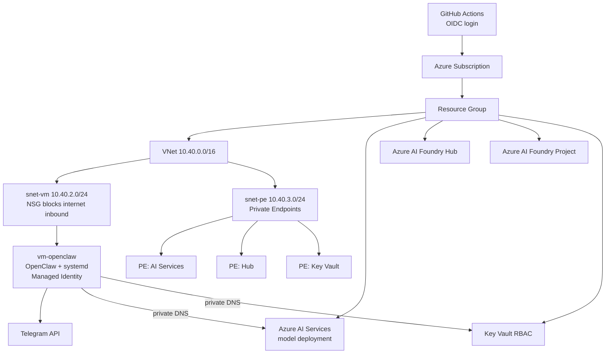

# openclaw-azure-foundry

Deploy a private OpenClaw assistant on Azure AI services, connect it to Telegram, and operate everything through GitHub Actions CI/CD.

This repository is designed for people who want:

1. No public VM endpoint.
2. No long-lived Azure credentials in GitHub.
3. Private Azure AI + Key Vault access from the VM.
4. Repeatable deployments via pull requests and protected main branch.

## What This Project Deploys

At a high level, one deployment creates:

1. A resource group.
2. A virtual network with a private VM subnet and private endpoint subnet.
3. An Azure AI Services account with model deployment.
4. Azure AI Foundry Hub and Project resources.
5. A private Key Vault with secrets.
6. A Linux VM with OpenClaw installed and managed by systemd.
7. Private endpoints and private DNS zone links for AI and Key Vault.

## Architecture



## Repository Layout

- [infrastructure/main.bicep](infrastructure/main.bicep): Root subscription-scope deployment.
- [infrastructure/modules](infrastructure/modules): Networking, compute, AI services/foundry, key vault, private endpoints.
- [infrastructure/cloud-init/cloud-init.yaml](infrastructure/cloud-init/cloud-init.yaml): VM bootstrap and OpenClaw configuration.
- [infrastructure/parameters](infrastructure/parameters): Environment parameter files.
- [openclaw-config](openclaw-config): Runtime OpenClaw config templates pushed by workflow.
- [.github/workflows](.github/workflows): Validate, infra deploy, and config update pipelines.
- [scripts](scripts): Operational helpers for connect/validate/teardown.
- [docs](docs): Setup, architecture, and troubleshooting details.

## Before You Start

## Prerequisites

1. Azure subscription where you can deploy at subscription scope.
2. GitHub repository with Actions enabled.
3. Azure CLI installed and logged in.
4. Telegram bot token from BotFather.
5. SSH keypair for VM access.

Suggested key generation:

```bash
ssh-keygen -t ed25519 -C "openclaw"
```

## Required Azure Permissions

For the identity used by GitHub Actions, assign at least:

1. Contributor on subscription (resource deployments).
2. User Access Administrator on subscription (RBAC assignment for VM managed identity to Key Vault).

## End-to-End Setup (Correct Order)

Follow these steps in order. This is the fastest path for a first successful CI/CD deployment.

### Step 1: Fork or Clone

```bash
git clone https://github.com/YOUR_ORG/openclaw-azure-foundry.git
cd openclaw-azure-foundry
```

### Step 2: Configure OIDC from GitHub to Azure

Use the sequence in [docs/SETUP.md](docs/SETUP.md) to:

1. Create Entra App Registration for CI/CD.
2. Create service principal.
3. Add federated credentials for main and pull request runs.
4. Assign Azure roles.

OIDC removes the need for stored service-principal secrets.

### Step 3: Configure GitHub Secrets and Variables

Set these in GitHub repository settings.

Secrets:

| Name | Value |
|------|-------|
| SSH_PUBLIC_KEY | Contents of your public key file |
| TELEGRAM_BOT_TOKEN | BotFather token |

Variables:

| Name | Value |
|------|-------|
| AZURE_CLIENT_ID | App registration client ID |
| AZURE_TENANT_ID | Entra tenant ID |
| AZURE_SUBSCRIPTION_ID | Target subscription ID |

### Step 4: Create GitHub Environment Gate

Create environment prod in GitHub and add required reviewers.

This enables the deployment approval gate used by infra pipeline.

### Step 5: Review Parameter File

Check [infrastructure/parameters/prod.bicepparam](infrastructure/parameters/prod.bicepparam):

1. Naming values are globally unique where required.
2. Region and VM size fit your needs.
3. Model and capacity settings are appropriate.

### Step 6: Push to Main

```bash
git push origin main
```

This triggers infra CI/CD.

## CI/CD Flow

### Validate Workflow

File: [validate.yml](.github/workflows/validate.yml)

Runs on pull requests and performs:

1. Bicep compilation/lint check.
2. ARM validation command.
3. Shell script linting.

### Infrastructure Deployment Workflow

File: [infra-deploy.yml](.github/workflows/infra-deploy.yml)

Runs on main for infrastructure changes and does:

1. What-if preview.
2. Deployment after prod approval.
3. Post-deploy VM verification.

### OpenClaw Config Workflow

File: [openclaw-config.yml](.github/workflows/openclaw-config.yml)

Runs on config changes and does:

1. Resolve latest deployed RG/VM/Key Vault.
2. Render config templates.
3. Pull secrets from Key Vault on VM via managed identity.
4. Apply config and restart OpenClaw.

## First Deployment Verification

After deployment succeeds, verify in this order.

### 1) Check Workflow Status

Confirm successful runs for:

1. Deploy Infrastructure.
2. Verify OpenClaw Status.

### 2) Validate VM and Service

```bash
./scripts/validate-deployment.sh
```

### 3) Connect to VM

```bash
az extension add -n ssh
./scripts/connect.sh
```

### 4) Check Service Health Logs

```bash
sudo systemctl status openclaw
sudo journalctl -u openclaw -n 100 --no-pager
```

### 5) Test Telegram

1. Send start or hello to your bot.
2. Confirm the bot responds.
3. If no response, inspect [docs/TROUBLESHOOTING.md](docs/TROUBLESHOOTING.md).

## Operational Model

Use this workflow after first success:

1. Infrastructure edits go through pull request, then merge to main.
2. Runtime config edits go in [openclaw-config](openclaw-config), then merge to main.
3. Never store API keys in repository files.
4. Use Key Vault as source of truth for secrets.

## Security Design Highlights

1. VM has no public IP.
2. NSG denies inbound from internet.
3. Azure AI and Key Vault public access are disabled.
4. VM uses managed identity to retrieve secrets.
5. GitHub Actions authenticates with OIDC, not client secret.

## Cost Guidance

Your cost depends mostly on:

1. VM SKU and uptime.
2. Azure AI model usage and capacity.
3. Private endpoint count.

Use Azure Cost Management and set budgets/alerts early.

## Common Pitfalls

1. Missing GitHub environment approval blocks deployment.
2. Wrong secret/variable names in repository settings.
3. Non-unique Azure resource names in parameter file.
4. Config drift when changing runtime manually on VM and not committing templates.
5. DNS/endpoint mismatch leading to model-not-found or 404 errors.

Use [docs/TROUBLESHOOTING.md](docs/TROUBLESHOOTING.md) for incident-oriented diagnostics.

## Cleanup

```bash
./scripts/teardown.sh
```

or

```bash
az group delete --name rg-openclaw --yes --no-wait
```

## Additional Documentation

- [docs/SETUP.md](docs/SETUP.md): Detailed command-level setup.
- [docs/ARCHITECTURE.md](docs/ARCHITECTURE.md): Deep architectural rationale.
- [docs/TROUBLESHOOTING.md](docs/TROUBLESHOOTING.md): Failure patterns and fixes.

## Contributing

Contributions are welcome. Please open an issue first for significant changes and ensure workflows pass before submitting a pull request.

## License

MIT. See [LICENSE](LICENSE).
