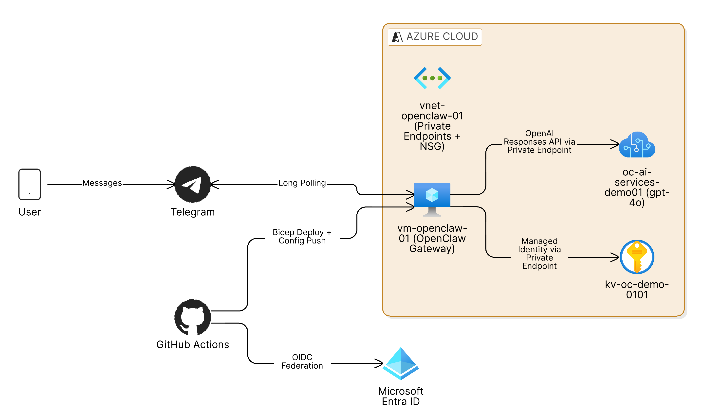

<div align="center">

# 🐾 OpenClaw on Azure Foundry

**The open-source CLI to deploy a private AI assistant on Azure**

[](https://www.npmjs.com/package/openclaw-azure-cli)
[](https://github.com/hkaanturgut/openclaw-azure-foundry/actions/workflows/infra-deploy.yml)
[](https://github.com/hkaanturgut/openclaw-azure-foundry/actions/workflows/validate.yml)
[](LICENSE)

A community-driven CLI tool for deploying [OpenClaw](https://openclaw.ai) on Azure — today on VMs with private networking, with container and serverless hosting on the roadmap. Three commands. Zero portal clicks.

[Quick Start](#-quick-start-cli) · [Architecture](#-architecture) · [Roadmap](#-roadmap) · [Contributing](#-contributing)

</div>

---

## 💻 Quick Start (CLI)

Deploy a fully private OpenClaw instance in three commands:

### Prerequisites

| Requirement | How to verify |
|-------------|---------------|
| Node.js ≥ 18 | `node --version` |
| Azure CLI | `az --version` |
| Azure subscription | `az account show` |
| Telegram bot token | From [@BotFather](https://t.me/BotFather) |

### Install & Deploy

```bash
# 1. Install the CLI from npm
npm install -g openclaw-azure-cli

# 2. Initialize — interactive prompts with smart defaults
openclaw-azure init

# 3. Deploy — preflight checks, Bicep deploy, validation, and Telegram pairing
openclaw-azure deploy

# When you're done — clean teardown with quota recovery
openclaw-azure destroy
```

> **Or run without installing:** `npx openclaw-azure-cli init` and `npx openclaw-azure-cli deploy`
>
> **📦 [View on npm](https://www.npmjs.com/package/openclaw-azure-cli)**

That's it. The CLI handles everything:

| Step | What the CLI does for you |
|------|---------------------------|
| **SSH keys** | Offers to generate an ed25519 keypair automatically |
| **Config** | Prompts for all values with sensible defaults, validates input |
| **Preflight** | Verifies Azure CLI, login, Bicep, and subscription access |
| **Deploy** | Runs a subscription-scoped Bicep deployment |
| **Validate** | Checks cloud-init, OpenClaw service, and private endpoint DNS |
| **Pairing** | Prompts for your Telegram pairing code and approves it on the VM |
| **Destroy** | Deletes the resource group and purges soft-deleted AI Services to free quota |

### CLI Commands

```
openclaw-azure init      # Interactive config wizard
openclaw-azure deploy    # Deploy, validate, and pair — all in one
openclaw-azure destroy   # Tear down everything and free quota
openclaw-azure help      # Show available commands
```

---

## ✨ Features

- 🖥️ **CLI-first** — Deploy, validate, pair, and destroy from your terminal
- 🔐 **Zero stored credentials** — VM uses managed identity; no secrets in the repo
- 🏰 **Fully private networking** — VM has no public IP; AI Services and Key Vault use private endpoints only
- 🤖 **Telegram integration** — Chat with GPT-4o through a Telegram bot with pairing-based access control
- 📦 **Infrastructure as Code** — Everything defined in Bicep with parameterized deployments
- 🧹 **Clean teardown** — Destroy command purges soft-deleted AI Services to recover quota immediately
- 🔄 **GitOps option** — Optional GitHub Actions CI/CD with OIDC federation (no stored cloud secrets)

---

## 🗺 Roadmap

This project is community-driven. We're building toward supporting multiple hosting options for OpenClaw on Azure:

| Hosting Target | Status |
|----------------|--------|
| **Azure VM** (private networking) | ✅ Available |
| **Azure Container Apps** | 🔜 Planned |
| **Azure Container Instances** | 🔜 Planned |
| **Azure Kubernetes Service (AKS)** | 🔜 Planned |

Have an idea or want to contribute a hosting target? [Open an issue](https://github.com/hkaanturgut/openclaw-azure-foundry/issues) or submit a PR!

---

## 🏗 Architecture

<div align="center">



</div>

### How It Works

| Flow | Description |
|------|-------------|
| **User → Telegram → VM** | Messages flow from Telegram to the OpenClaw gateway on a private VM via long polling |
| **VM → Azure AI Services** | OpenClaw calls GPT-4o via the OpenAI Responses API through a private endpoint |
| **VM → Key Vault** | The VM's managed identity reads secrets (API key, bot token) through a private endpoint |
| **GitHub Actions → Azure** | CI/CD authenticates via OIDC federation with Entra ID — no stored service principal secrets |

### Security Model

| Layer | Control |
|-------|---------|
| Network | VM has no public IP; NSG blocks all inbound internet traffic |
| AI Services | Public access disabled; accessible only via private endpoint |
| Key Vault | Public access disabled; accessible only via private endpoint |
| Identity | VM uses managed identity; GitHub Actions uses OIDC federation |
| Access | Telegram bot uses pairing mode — only approved senders can interact |

---

## 📁 Repository Structure

```
openclaw-azure-foundry/
├── cli/                       # 🖥️ CLI tool (primary interface)
│   ├── src/                   #   TypeScript source
│   ├── package.json           #   Dependencies and scripts
│   └── README.md              #   CLI development guide
├── infrastructure/
│   ├── main.bicep             # Root subscription-scope deployment
│   ├── modules/               # Networking, compute, AI, Key Vault, private endpoints
│   ├── parameters/            # Environment parameter files
│   └── cloud-init/            # VM bootstrap (Node.js, Azure CLI, OpenClaw, systemd)
├── .github/workflows/         # Optional CI/CD pipelines
├── openclaw-config/           # Runtime config templates
├── scripts/                   # Operational helpers
└── docs/                      # Extended documentation
```

---

## 🔄 CI/CD Workflows (Optional)

For teams that prefer GitOps over the CLI:

| Workflow | Trigger | What It Does |
|----------|---------|--------------|
| **[Bootstrap OIDC](.github/workflows/bootstrap-oidc.yml)** | Manual | Creates Entra app registration, service principal, federated credentials, role assignments, and sets repo variables/secrets |
| **[Validate](.github/workflows/validate.yml)** | Pull request | Runs Bicep compile/lint, ARM template validation, and shell script linting |
| **[Deploy Infrastructure](.github/workflows/infra-deploy.yml)** | Push to `main` | What-if preview → `prod` approval gate → Bicep deployment → VM health check |
| **[Update Config](.github/workflows/openclaw-config.yml)** | Push to `main` | Renders config templates, fetches secrets on VM via managed identity, restarts OpenClaw |
| **[Approve Pairing](.github/workflows/approve-pairing.yml)** | Manual | Approves a Telegram pairing code for a new user |

<details>
<summary><b>GitHub Actions setup guide</b></summary>

1. Create a [classic PAT](https://github.com/settings/tokens) with `repo` scope
2. `gh secret set BOOTSTRAP_GH_PAT`
3. `gh workflow run bootstrap-oidc.yml`
4. Create a `prod` environment in **Settings → Environments** with required reviewers
5. Customize `infrastructure/parameters/prod.bicepparam` and push to `main`

</details>

---

## 🔧 Operations

### Connect to VM

```bash
az extension add -n ssh
./scripts/connect.sh
```

### Check Service Logs

```bash
# On the VM:
sudo systemctl status openclaw
sudo journalctl -u openclaw -n 100 --no-pager
```

### Rotate Secrets

Update the secret in Key Vault, then restart the service on the VM or re-trigger the config workflow.

---

## ⚠️ Common Pitfalls

| Problem | Cause | Fix |
|---------|-------|-----|
| `404 Resource not found` from AI model | Wrong `baseUrl` in config | Ensure `baseUrl` ends with `/openai/v1` and `api` is `openai-responses` |
| Bot not responding | Pairing not approved or service crashed | Re-run `openclaw-azure deploy` or check `systemctl status openclaw` |
| `InsufficientQuota` on redeploy | AI Services soft-delete holds quota for 48h | Run `openclaw-azure destroy` (auto-purges) or manually purge (see below) |
| `HTTP 403` on bootstrap secrets step | `BOOTSTRAP_GH_PAT` missing or expired | Regenerate PAT with `repo` scope |

### Manually Recovering Quota from Soft-Deleted AI Services

```bash
# List soft-deleted accounts
az cognitiveservices account list-deleted --query "[].{name:name, location:location}" -o table

# Purge to release quota immediately
az cognitiveservices account purge \
  --name <account-name> \
  --resource-group <original-rg-name> \
  --location <region>
```

---

## 💰 Cost Guidance

Primary cost drivers:

- **VM** — SKU and uptime (use `Standard_B2s` for demos)
- **Azure AI Services** — Token usage and provisioned capacity
- **Private endpoints** — Per-endpoint hourly charge

> 💡 **Tip:** Set [Azure budget alerts](https://learn.microsoft.com/en-us/azure/cost-management-billing/costs/tutorial-acm-create-budgets) early. For demos, run `openclaw-azure destroy` immediately after.

---

## ❓ FAQ

<details>
<summary><b>Do I have to use GitHub Actions?</b></summary>
<br>
No. The CLI is the primary and recommended way to deploy. GitHub Actions workflows are optional for teams that prefer GitOps.
</details>

<details>
<summary><b>Is the VM publicly exposed?</b></summary>
<br>
No. The VM has no public IP and is only accessible through Azure tools (<code>az vm run-command</code>, <code>az ssh vm</code>).
</details>

<details>
<summary><b>Where are secrets stored?</b></summary>
<br>
In Azure Key Vault. The VM retrieves them at runtime through its managed identity via a private endpoint. No secrets are stored in the repository.
</details>

<details>
<summary><b>Can I use a different AI model?</b></summary>
<br>
Yes. During <code>openclaw-azure init</code>, specify a different <code>modelName</code> and <code>modelVersion</code>.
</details>

<details>
<summary><b>Can I use a different chat platform instead of Telegram?</b></summary>
<br>
OpenClaw supports multiple platforms. Check the <a href="https://openclaw.ai">OpenClaw documentation</a> for available integrations.
</details>

<details>
<summary><b>Will this support containers?</b></summary>
<br>
Yes! Azure Container Apps, ACI, and AKS hosting targets are on the <a href="#-roadmap">roadmap</a>. Contributions welcome!
</details>

---

## 📚 Additional Documentation

| Document | Description |
|----------|-------------|
| [docs/SETUP.md](docs/SETUP.md) | Detailed command-level setup guide |
| [docs/ARCHITECTURE.md](docs/ARCHITECTURE.md) | Deep architectural rationale |
| [docs/TROUBLESHOOTING.md](docs/TROUBLESHOOTING.md) | Failure patterns and fixes |
| [docs/BOOTSTRAP-CHECKLIST.md](docs/BOOTSTRAP-CHECKLIST.md) | Bootstrap automation checklist |

---

## 🤝 Contributing

Contributions are welcome! This is a community-driven project and we'd love your help.

**Ways to contribute:**

- 🐛 **Bug fixes** — Found something broken? Submit a PR
- 🚀 **New hosting targets** — Help us add Container Apps, ACI, or AKS support
- 📖 **Documentation** — Improve guides, add examples, fix typos
- 💡 **Feature ideas** — Open an issue to discuss new capabilities

**How to contribute:**

1. **Fork** the repository
2. **Create** a feature branch (`git checkout -b feature/amazing-feature`)
3. **Make** your changes and ensure workflows pass
4. **Open** a pull request

Please open an issue first for significant changes to discuss the approach.

---

## 📄 License

This project is licensed under the MIT License — see the [LICENSE](LICENSE) file for details.

---

<div align="center">

**Built with ❤️ by [Kaan Turgut](https://github.com/hkaanturgut) and the community**

⭐ If you found this useful, please consider giving it a star!

</div>
